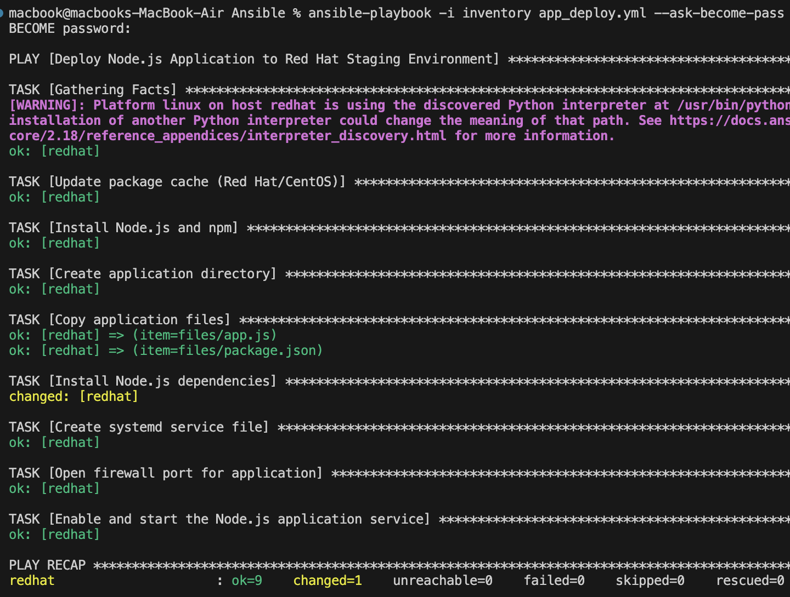
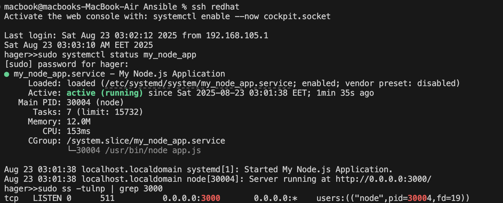
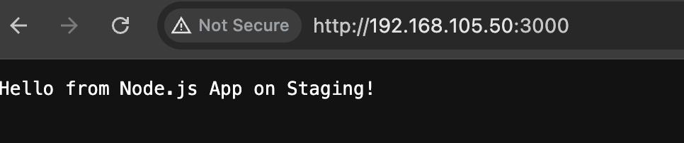

# Ansible Staging Deployment (RHEL) 

## Project Structure

```
ansible-staging-app/
├── inventory.ini
├── app_deploy.yml
├── files/
│   ├── app.js
│   └── package.json
└── templates/
    └── my_node_app.service.j2
```

> Notes: The target VM is RHEL .
---

## 1) `inventory.ini`

```ini
[web]
redhat ansible_user=hager
```

* `redhat` is the SSH host alias from `~/.ssh/config` on the control node.
* `ansible_user` should be the SSH user on the VM.

---

## 2) `app_deploy.yml`

A RHEL playbook that installs Node.js (via NodeSource), deploys the app, creates a systemd service, opens the firewall, and starts the service.

```yaml
---
- name: Deploy Node.js Application to Red Hat Staging Environment
  hosts: web
  become: yes
  vars:
    app_name: my_node_app
    app_dir: /opt/{{ app_name }}
    app_port: 3000

  tasks:
    - name: Update package cache (Red Hat/CentOS)
      yum:
        update_cache: yes

    - name: Install Node.js and npm
      yum:
        name:
          - nodejs
          - npm
        state: present

    - name: Create application directory
      file:
        path: "{{ app_dir }}"
        state: directory
        owner: hager
        group: hager
        mode: '0755'

    - name: Copy application files
      copy:
        src: "{{ item }}"
        dest: "{{ app_dir }}/{{ item | basename }}"
        owner: hager
        group: hager
        mode: '0644'
      loop:
        - files/app.js
        - files/package.json
      notify:
        - restart node app

    - name: Install Node.js dependencies
      npm:
        path: "{{ app_dir }}"
      become_user: hager

    - name: Create systemd service file
      template:
        src: templates/my_node_app.service.j2
        dest: /etc/systemd/system/{{ app_name }}.service
        mode: '0644'
      notify:
        - reload systemd
        - restart node app

    - name: Open firewall port for application
      firewalld:
        port: "{{ app_port }}/tcp"
        permanent: yes
        state: enabled
        immediate: yes

    - name: Enable and start the Node.js application service
      systemd:
        name: "{{ app_name }}"
        state: started
        enabled: yes
        daemon_reload: yes

  handlers:
    - name: reload systemd
      systemd:
        daemon_reload: yes

    - name: restart node app
      systemd:
        name: "{{ app_name }}"
        state: restarted
```

---

## 3) `files/app.js`

```javascript
const http = require('http');
const hostname = '0.0.0.0';
const port = 3000;

const server = http.createServer((req, res) => {
  res.statusCode = 200;
  res.setHeader('Content-Type', 'text/plain');
  res.end('Hello from Node.js App on Staging!\n');
});

server.listen(port, hostname, () => {
  console.log(`Server running at http://${hostname}:${port}/`);
});
```

### `files/package.json`

```json
{
  "name": "simple-node-app",
  "version": "1.0.0",
  "description": "A simple Node.js web app for Ansible deployment",
  "main": "app.js",
  "scripts": {
    "start": "node app.js"
  },
  "dependencies": {}
}
```

---

## 4)`templates/my_node_app.service.j2`

```ini
[Unit]
Description=My Node.js Application
After=network.target

[Service]
User={{ app_user | default(ansible_user) }}
WorkingDirectory={{ app_dir }}
ExecStart={{ node_bin }} app.js
Restart=always
Environment=PATH=/usr/bin:/usr/local/bin

[Install]
WantedBy=multi-user.target
```

---

## 5) How to Run

```bash
# Dry-run first 
ansible-playbook -i inventory app_deploy.yml --check --diff --ask-become-pass

# Real run
ansible-playbook -i inventory app_deploy.yml --ask-become-pass
```

---

## 6) What to Screenshot for Submission

1. **Successful playbook run**

   * The console output ending with tasks `Ensure Node.js app service is started and enabled`.



2. **Service status on the VM && Port listening on the VM**

   ```bash
   sudo systemctl status my_node_app
   ```
   ```bash
   sudo ss -tulnp | grep 3000
   ```



4. **Browser hitting the app**




---

## 7) Brief Explanation 

I kept this deliberately simple and staging-first. The playbook updates the package cache, installs a few build tools and firewalld, enables the NodeSource repo , installs Node.js, creates `/opt/my_node_app`, copies `app.js` and `package.json`, runs `npm install` as the app user, drops a systemd unit, reloads systemd, opens port **3000/tcp** in firewalld, and finally enables & starts the service.

For validation, I checked three things: systemd says the unit is **active (running)**, `ss` shows the process listening on `0.0.0.0:3000`, and the browser returns the expected string from the app. I also made sure the cloud firewall allows port 3000, not just the OS firewall. A tiny gotcha I hit during dry-run: with `--check`, tasks like `npm install` and enabling repos can’t really “pretend” safely, so I skip them in check-mode to keep the dry-run clean.

**Personal note:** I prefer to parametrize paths and the Node binary in the template (`app_dir`, `app_name`) so I can reuse the same playbook for dev/staging/prod without editing the file each time. Using `firewalld` is more natural on RHEL than UFW, so I leaned on the `ansible.posix.firewalld` module here.

---

## 8) Troubleshooting Quickies

* `Missing sudo password`: run with `--ask-become-pass` or configure passwordless sudo for the SSH user.
* `ansible_user is undefined`: set it in `inventory` or pass `-e ansible_user=hager`.
* `--check` failing at `npm install` or repo setup: those tasks are skipped during check-mode in this playbook.

---

## 9) Commands I Actually Used

```bash
ansible-inventory -i inventory --graph
ansible -i inventory web -m ping
ansible-playbook -i inventory app_deploy.yml --check --diff --ask-become-pass
ansible-playbook -i inventory app_deploy.yml --ask-become-pass
ssh redhat 'sudo systemctl status my_node_app || true'
ssh redhat 'sudo ss -tulnp | grep 3000 || true'
```

---