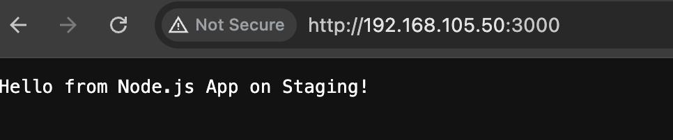

# Complete CI/CD Solution - Jenkins + Terraform + Ansible + Docker

## Repository Structure
```
.
├── Jenkinsfile.provision          # Pipeline 1
├── Jenkinsfile.deploy             # Pipeline 2  
├── Jenkinsfile.cleanup            # Pipeline 3
├── terraform/
│   ├── main.tf
│   ├── variables.tf
│   ├── outputs.tf
│   └── backend.tf
├── ansible/
│   └── playbook.yml
└── docker/
    └── index.html
```

## Prerequisites Setup

### 1. Jenkins Credentials Required
- **AWS Credentials**: `aws-credentials` (AWS Access Key ID & Secret)
- **Docker Hub**: `dockerhub-credentials` (Username & Password)
- **SSH Key**: `ec2-ssh-key` (Private key for EC2 access)

### 2. Jenkins Plugins Required
- AWS Pipeline Steps
- Terraform
- Ansible
- Docker Pipeline
- Pipeline Stage View

### 3. AWS IAM Policy for Jenkins (Least Privilege)
```json
{
    "Version": "2012-10-17",
    "Statement": [
        {
            "Effect": "Allow",
            "Action": [
                "ec2:RunInstances",
                "ec2:TerminateInstances",
                "ec2:DescribeInstances",
                "ec2:CreateTags",
                "ec2:DescribeTags",
                "ec2:DescribeSecurityGroups",
                "ec2:DescribeKeyPairs",
                "ec2:DescribeSubnets",
                "ec2:DescribeVpcs"
            ],
            "Resource": "*"
        },
        {
            "Effect": "Allow",
            "Action": [
                "s3:GetObject",
                "s3:PutObject",
                "s3:DeleteObject",
                "s3:ListBucket"
            ],
            "Resource": [
                "arn:aws:s3:::your-terraform-state-bucket",
                "arn:aws:s3:::your-terraform-state-bucket/*"
            ]
        },
        {
            "Effect": "Allow",
            "Action": [
                "dynamodb:GetItem",
                "dynamodb:PutItem",
                "dynamodb:DeleteItem"
            ],
            "Resource": "arn:aws:dynamodb:*:*:table/terraform-state-lock"
        }
    ]
}
```

## File Contents

### terraform/backend.tf
```hcl
terraform {
  backend "s3" {
    bucket         = "your-terraform-state-bucket"
    key            = "jenkins-ci/terraform.tfstate"
    region         = "us-east-1"
    dynamodb_table = "terraform-state-lock"
    encrypt        = true
  }
}
```

### terraform/variables.tf
```hcl
variable "aws_region" {
  description = "AWS region"
  type        = string
  default     = "us-east-1"
}

variable "instance_type" {
  description = "EC2 instance type"
  type        = string
  default     = "t2.micro"
}

variable "key_name" {
  description = "AWS key pair name"
  type        = string
  default     = "your-ec2-keypair"
}

variable "build_number" {
  description = "Jenkins build number"
  type        = string
  default     = "unknown"
}
```

### terraform/main.tf
```hcl
provider "aws" {
  region = var.aws_region
}

# Get default VPC
data "aws_vpc" "default" {
  default = true
}

# Get default subnet
data "aws_subnet" "default" {
  vpc_id            = data.aws_vpc.default.id
  availability_zone = "${var.aws_region}a"
  default_for_az    = true
}

# Security group for web access
resource "aws_security_group" "web_sg" {
  name_prefix = "jenkins-ci-"
  vpc_id      = data.aws_vpc.default.id

  ingress {
    from_port   = 22
    to_port     = 22
    protocol    = "tcp"
    cidr_blocks = ["0.0.0.0/0"]
  }

  ingress {
    from_port   = 80
    to_port     = 80
    protocol    = "tcp"
    cidr_blocks = ["0.0.0.0/0"]
  }

  egress {
    from_port   = 0
    to_port     = 0
    protocol    = "-1"
    cidr_blocks = ["0.0.0.0/0"]
  }

  tags = {
    Name      = "jenkins-ci-sg-${var.build_number}"
    lifespan  = "ephemeral"
    owner     = "jenkins"
  }
}

# Get latest Amazon Linux 2 AMI
data "aws_ami" "amazon_linux" {
  most_recent = true
  owners      = ["amazon"]

  filter {
    name   = "name"
    values = ["amzn2-ami-hvm-*-x86_64-gp2"]
  }
}

# EC2 instance
resource "aws_instance" "ci_instance" {
  ami                    = data.aws_ami.amazon_linux.id
  instance_type          = var.instance_type
  key_name              = var.key_name
  subnet_id             = data.aws_subnet.default.id
  vpc_security_group_ids = [aws_security_group.web_sg.id]

  associate_public_ip_address = true

  tags = {
    Name      = "ci-ephemeral-${var.build_number}"
    lifespan  = "ephemeral"
    owner     = "jenkins"
    BuildNumber = var.build_number
  }

  # Wait for instance to be ready
  user_data = <<-EOF
    #!/bin/bash
    yum update -y
    # Install python3 for Ansible
    yum install -y python3
  EOF
}
```

### terraform/outputs.tf
```hcl
output "public_ip" {
  description = "Public IP of the EC2 instance"
  value       = aws_instance.ci_instance.public_ip
}

output "instance_id" {
  description = "Instance ID"
  value       = aws_instance.ci_instance.id
}
```

### ansible/playbook.yml
```yaml
---
- name: Configure Docker on EC2 instance
  hosts: all
  remote_user: ec2-user
  become: yes
  gather_facts: yes

  tasks:
    - name: Update system packages
      yum:
        name: "*"
        state: latest

    - name: Install Docker
      yum:
        name: docker
        state: present

    - name: Start Docker service
      systemd:
        name: docker
        state: started
        enabled: yes

    - name: Add ec2-user to docker group
      user:
        name: ec2-user
        groups: docker
        append: yes

    - name: Install Docker Compose (optional)
      pip:
        name: docker-compose
        executable: pip3

    - name: Verify Docker installation
      command: docker --version
      register: docker_version

    - name: Display Docker version
      debug:
        msg: "Docker installed successfully: {{ docker_version.stdout }}"
```

### docker/index.html
```html
<!DOCTYPE html>
<html lang="en">
<head>
    <meta charset="UTF-8">
    <meta name="viewport" content="width=device-width, initial-scale=1.0">
    <title>Jenkins CI/CD Demo</title>
    <style>
        body { 
            font-family: Arial, sans-serif; 
            margin: 40px; 
            background: linear-gradient(135deg, #667eea 0%, #764ba2 100%);
            color: white;
            text-align: center;
        }
        .container { 
            background: rgba(255,255,255,0.1); 
            padding: 30px; 
            border-radius: 10px; 
            backdrop-filter: blur(10px);
        }
        .build-info { 
            background: rgba(0,0,0,0.2); 
            padding: 15px; 
            border-radius: 5px; 
            margin: 20px 0; 
        }
    </style>
</head>
<body>
    <div class="container">
        <h1>Jenkins CI/CD Pipeline Demo</h1>
        <div class="build-info">
            <h2>Build Information</h2>
            <p><strong>Build Number:</strong> BUILD_NUMBER_PLACEHOLDER</p>
            <p><strong>Deployed At:</strong> TIMESTAMP_PLACEHOLDER</p>
            <p><strong>Pipeline:</strong> Terraform → Ansible → Docker → Deploy</p>
        </div>
        <p>Successfully deployed via Jenkins CI/CD Pipeline!</p>
        <p>Infrastructure provisioned with Terraform, configured with Ansible, and deployed with Docker.</p>
    </div>
</body>
</html>
```

### Jenkinsfile.provision
```groovy
pipeline {
    agent any
    
    environment {
        AWS_DEFAULT_REGION = 'us-east-1'
        TF_VAR_build_number = "${BUILD_NUMBER}"
    }
    
    stages {
        stage('Checkout') {
            steps {
                checkout scm
            }
        }
        
        stage('Terraform Init') {
            steps {
                withCredentials([[$class: 'AmazonWebServicesCredentialsBinding', 
                                credentialsId: 'aws-credentials']]) {
                    dir('terraform') {
                        sh '''
                            terraform init
                            terraform workspace select default || terraform workspace new default
                        '''
                    }
                }
            }
        }
        
        stage('Terraform Plan') {
            steps {
                withCredentials([[$class: 'AmazonWebServicesCredentialsBinding', 
                                credentialsId: 'aws-credentials']]) {
                    dir('terraform') {
                        sh 'terraform plan -out=tfplan'
                    }
                }
            }
        }
        
        stage('Terraform Apply') {
            steps {
                withCredentials([[$class: 'AmazonWebServicesCredentialsBinding', 
                                credentialsId: 'aws-credentials']]) {
                    dir('terraform') {
                        sh 'terraform apply -auto-approve tfplan'
                        script {
                            env.EC2_PUBLIC_IP = sh(
                                script: 'terraform output -raw public_ip',
                                returnStdout: true
                            ).trim()
                        }
                    }
                }
            }
        }
        
        stage('Wait for Instance') {
            steps {
                script {
                    echo "Waiting for EC2 instance to be ready..."
                    sh "sleep 60"
                    
                    // Test SSH connectivity
                    withCredentials([sshUserPrivateKey(credentialsId: 'ec2-ssh-key', 
                                                     keyFileVariable: 'SSH_KEY')]) {
                        sh """
                            chmod 600 \$SSH_KEY
                            for i in {1..10}; do
                                if ssh -o StrictHostKeyChecking=no -o ConnectTimeout=10 \
                                   -i \$SSH_KEY ec2-user@${env.EC2_PUBLIC_IP} 'echo "SSH Ready"'; then
                                    echo "SSH connection successful"
                                    break
                                fi
                                echo "Attempt \$i failed, retrying in 15 seconds..."
                                sleep 15
                            done
                        """
                    }
                }
            }
        }
        
        stage('Configure with Ansible') {
            steps {
                withCredentials([sshUserPrivateKey(credentialsId: 'ec2-ssh-key', 
                                                 keyFileVariable: 'SSH_KEY')]) {
                    dir('ansible') {
                        sh """
                            chmod 600 \$SSH_KEY
                            echo '[webservers]' > inventory
                            echo '${env.EC2_PUBLIC_IP} ansible_user=ec2-user ansible_ssh_private_key_file=\$SSH_KEY' >> inventory
                            
                            ansible-playbook -i inventory playbook.yml \
                                --ssh-extra-args='-o StrictHostKeyChecking=no'
                        """
                    }
                }
            }
        }
        
        stage('Trigger Deploy Pipeline') {
            steps {
                script {
                    build job: 'deploy-pipeline', 
                          parameters: [string(name: 'EC2_IP', value: env.EC2_PUBLIC_IP)],
                          wait: false
                }
            }
        }
    }
    
    post {
        always {
            echo "Pipeline completed. EC2 IP: ${env.EC2_PUBLIC_IP}"
        }
        failure {
            echo "Pipeline failed. Check logs for details."
        }
    }
}
```

### Jenkinsfile.deploy
```groovy
pipeline {
    agent any
    
    parameters {
        string(name: 'EC2_IP', description: 'EC2 Instance Public IP', defaultValue: '')
    }
    
    environment {
        DOCKER_IMAGE = "your-dockerhub-username/nginx-ci:${BUILD_NUMBER}"
        CONTAINER_NAME = "web"
    }
    
    stages {
        stage('Validate Parameters') {
            steps {
                script {
                    if (!params.EC2_IP) {
                        error("EC2_IP parameter is required!")
                    }
                    echo "Deploying to EC2: ${params.EC2_IP}"
                }
            }
        }
        
        stage('Prepare Docker Files') {
            steps {
                script {
                    // Create custom index.html with build info
                    def timestamp = new Date().format('yyyy-MM-dd HH:mm:ss')
                    def htmlContent = readFile('docker/index.html')
                    htmlContent = htmlContent.replace('BUILD_NUMBER_PLACEHOLDER', BUILD_NUMBER)
                    htmlContent = htmlContent.replace('TIMESTAMP_PLACEHOLDER', timestamp)
                    writeFile file: 'index.html', text: htmlContent
                    
                    // Create Dockerfile
                    writeFile file: 'Dockerfile', text: '''
FROM nginx:alpine
COPY index.html /usr/share/nginx/html/
EXPOSE 80
CMD ["nginx", "-g", "daemon off;"]
'''
                }
            }
        }
        
        stage('Build Docker Image') {
            steps {
                script {
                    sh "docker build -t ${env.DOCKER_IMAGE} ."
                }
            }
        }
        
        stage('Push to Docker Hub') {
            steps {
                withCredentials([usernamePassword(credentialsId: 'dockerhub-credentials', 
                                                passwordVariable: 'DOCKER_PASSWORD', 
                                                usernameVariable: 'DOCKER_USERNAME')]) {
                    sh '''
                        echo $DOCKER_PASSWORD | docker login -u $DOCKER_USERNAME --password-stdin
                        docker push ${DOCKER_IMAGE}
                        docker logout
                    '''
                }
            }
        }
        
        stage('Deploy to EC2') {
            steps {
                withCredentials([sshUserPrivateKey(credentialsId: 'ec2-ssh-key', 
                                                 keyFileVariable: 'SSH_KEY')]) {
                    sh """
                        chmod 600 \$SSH_KEY
                        
                        # Deploy via SSH
                        ssh -o StrictHostKeyChecking=no -i \$SSH_KEY ec2-user@${params.EC2_IP} '
                            # Stop and remove existing container if exists
                            sudo docker stop ${env.CONTAINER_NAME} 2>/dev/null || true
                            sudo docker rm ${env.CONTAINER_NAME} 2>/dev/null || true
                            
                            # Pull and run new container
                            sudo docker pull ${env.DOCKER_IMAGE}
                            sudo docker run -d --name ${env.CONTAINER_NAME} -p 80:80 ${env.DOCKER_IMAGE}
                            
                            # Verify deployment
                            sleep 5
                            sudo docker ps | grep ${env.CONTAINER_NAME}
                        '
                    """
                }
            }
        }
        
        stage('Verify Deployment') {
            steps {
                script {
                    sh """
                        # Test web server response
                        for i in {1..5}; do
                            if curl -f -s http://${params.EC2_IP}/; then
                                echo " Deployment successful! Web server responding."
                                break
                            fi
                            echo "Attempt \$i failed, retrying in 10 seconds..."
                            sleep 10
                        done
                        
                        # Show the page content
                        echo "=== Web Page Content ==="
                        curl -s http://${params.EC2_IP}/ || echo "Failed to fetch page content"
                    """
                }
            }
        }
    }
    
    post {
        always {
            sh 'docker system prune -f || true'
        }
        success {
            echo "Deployment successful! Application available at: http://${params.EC2_IP}/"
        }
        failure {
            echo "Deployment failed. Check logs for details."
        }
    }
}
```

### Jenkinsfile.cleanup
```groovy
pipeline {
    agent any
    
    environment {
        AWS_DEFAULT_REGION = 'us-east-1'
    }
    
    triggers {
        // Schedule for 12:00 AM Africa/Cairo (UTC+2) = 22:00 UTC
        cron('TZ=Africa/Cairo\n0 0 * * *')
    }
    
    stages {
        stage('Find Ephemeral Instances') {
            steps {
                withCredentials([[$class: 'AmazonWebServicesCredentialsBinding', 
                                credentialsId: 'aws-credentials']]) {
                    script {
                        def instances = sh(
                            script: '''
                                aws ec2 describe-instances \
                                    --filters "Name=tag:lifespan,Values=ephemeral" \
                                              "Name=instance-state-name,Values=pending,running,stopping,stopped" \
                                    --query 'Reservations[].Instances[].[InstanceId,State.Name,Tags[?Key==`Name`].Value|[0]]' \
                                    --output text
                            ''',
                            returnStdout: true
                        ).trim()
                        
                        if (instances) {
                            env.INSTANCES_TO_CLEANUP = instances
                            echo "Found ephemeral instances:"
                            echo instances
                        } else {
                            echo "No ephemeral instances found."
                            env.INSTANCES_TO_CLEANUP = ""
                        }
                    }
                }
            }
        }
        
        stage('Terminate Instances') {
            when {
                expression { env.INSTANCES_TO_CLEANUP != "" }
            }
            steps {
                withCredentials([[$class: 'AmazonWebServicesCredentialsBinding', 
                                credentialsId: 'aws-credentials']]) {
                    script {
                        def instanceIds = sh(
                            script: '''
                                aws ec2 describe-instances \
                                    --filters "Name=tag:lifespan,Values=ephemeral" \
                                              "Name=instance-state-name,Values=pending,running,stopping,stopped" \
                                    --query 'Reservations[].Instances[].InstanceId' \
                                    --output text
                            ''',
                            returnStdout: true
                        ).trim().split(/\s+/)
                        
                        if (instanceIds && instanceIds[0] != "") {
                            def idList = instanceIds.join(' ')
                            
                            echo "Terminating instances: ${idList}"
                            
                            sh """
                                aws ec2 terminate-instances --instance-ids ${idList}
                            """
                            
                            echo "Successfully initiated termination for ${instanceIds.size()} instance(s)"
                            
                            // Log each terminated instance
                            instanceIds.each { id ->
                                echo "🗑️ Terminated instance: ${id}"
                            }
                        }
                    }
                }
            }
        }
        
        stage('Cleanup Security Groups') {
            steps {
                withCredentials([[$class: 'AmazonWebServicesCredentialsBinding', 
                                credentialsId: 'aws-credentials']]) {
                    script {
                        // Wait a bit for instances to start terminating
                        sh "sleep 30"
                        
                        // Find and delete unused security groups created by Jenkins
                        sh '''
                            # Find security groups created by Jenkins CI
                            SG_IDS=$(aws ec2 describe-security-groups \
                                --filters "Name=tag:owner,Values=jenkins" \
                                          "Name=group-name,Values=jenkins-ci-*" \
                                --query 'SecurityGroups[].GroupId' \
                                --output text)
                            
                            if [ ! -z "$SG_IDS" ]; then
                                for sg_id in $SG_IDS; do
                                    # Check if security group is still in use
                                    INSTANCES_USING_SG=$(aws ec2 describe-instances \
                                        --filters "Name=instance.group-id,Values=$sg_id" \
                                                  "Name=instance-state-name,Values=pending,running,stopping" \
                                        --query 'Reservations[].Instances[].InstanceId' \
                                        --output text)
                                    
                                    if [ -z "$INSTANCES_USING_SG" ]; then
                                        echo "Deleting unused security group: $sg_id"
                                        aws ec2 delete-security-group --group-id $sg_id || echo "Failed to delete $sg_id"
                                    else
                                        echo "Security group $sg_id still in use, skipping"
                                    fi
                                done
                            else
                                echo "No Jenkins security groups found for cleanup"
                            fi
                        '''
                    }
                }
            }
        }
    }
    
    post {
        always {
            script {
                def timestamp = new Date().format('yyyy-MM-dd HH:mm:ss')
                echo "🕐 Cleanup completed at ${timestamp} (Africa/Cairo timezone)"
                
                if (env.INSTANCES_TO_CLEANUP != "") {
                    echo "📊 Cleanup Summary:"
                    echo env.INSTANCES_TO_CLEANUP
                } else {
                    echo "📊 No ephemeral instances found for cleanup"
                }
            }
        }
        success {
            echo "Daily cleanup completed successfully"
        }
        failure {
            echo "aily cleanup failed. Check logs for details."
        }
    }
}
```

## Setup Instructions

### Step 1: Prepare AWS Resources
1. Create S3 bucket for Terraform state: `your-terraform-state-bucket`
2. Create DynamoDB table for state locking: `terraform-state-lock`
3. Create EC2 Key Pair for SSH access
4. Create IAM user with the provided policy

### Step 2: Configure Jenkins
1. Install required plugins
2. Add credentials:
   - AWS credentials (Access Key ID & Secret)
   - Docker Hub credentials
   - EC2 SSH private key
3. Create three Jenkins jobs:
   - `provision-pipeline` (Pipeline from SCM, Jenkinsfile.provision)
   - `deploy-pipeline` (Pipeline from SCM, Jenkinsfile.deploy)
   - `cleanup-pipeline` (Pipeline from SCM, Jenkinsfile.cleanup)

### Step 3: Configure Webhooks
1. In your Git repository settings, add webhook pointing to:
   `http://your-jenkins-url/job/provision-pipeline/build`
2. Set trigger for push events to main branch

### Step 4: Test the Pipeline
1. Push code to main branch
2. Verify Pipeline 1 creates EC2 instance
3. Verify Pipeline 2 deploys application
4. Check application at EC2 public IP
5. Wait for midnight Cairo time to test cleanup

## Expected Results

### Pipeline 1 Success Indicators:
- ✅ Terraform creates EC2 instance with correct tags
- ✅ Ansible installs Docker successfully
- ✅ Pipeline 2 triggers automatically with EC2 IP

### Pipeline 2 Success Indicators:
- ✅ Docker image builds with custom HTML
- ✅ Image pushes to private Docker Hub
- ✅ Container deploys and runs on port 80
- ✅ Web page shows build number and timestamp

### Pipeline 3 Success Indicators:
- ✅ Runs at exactly 12:00 AM Cairo time
- ✅ Finds all instances with lifespan=ephemeral tag
- ✅ Terminates all ephemeral instances
- ✅ Logs show terminated instance IDs

## Screenshots to Capture

1. **Jenkins Pipeline View** - showing all three pipelines
2. **Pipeline 1 Console Output** - Terraform apply and Ansible execution
3. **Pipeline 2 Console Output** - Docker build and deployment
4. **Web Browser** - showing deployed application with build number
5. **Pipeline 3 Console Output** - cleanup execution at midnight
6. **AWS Console** - showing terminated instances
7. **Docker Hub** - showing pushed images

This solution provides a complete, production-ready CI/CD pipeline that meets all the requirements specified in your task.

