# **📌1- Use cat /etc/passwd and identify the different fields in one of the entries. Extract your own user's info and explain.**📌

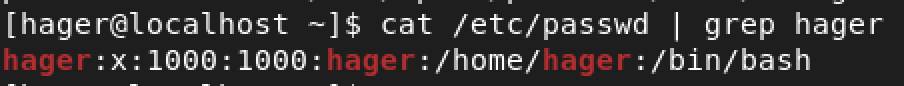
1- username 
2- password 
3- user id 
4- group id 
5- comment
6- home dir for this user 
7- type of bash for this user 
# **📌2-Explain the difference between the cat and more commands with examples.**📌
cat >> show all command output 
more >> show it in one page at a time  and press entir to get the next page 

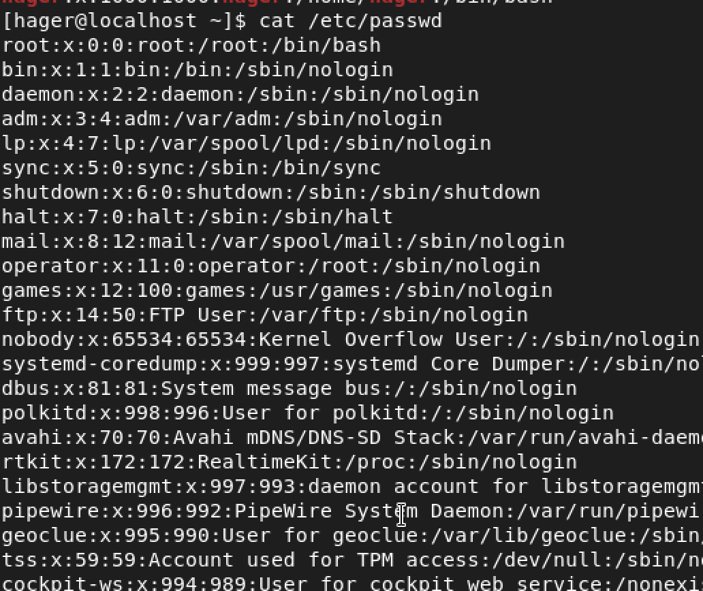
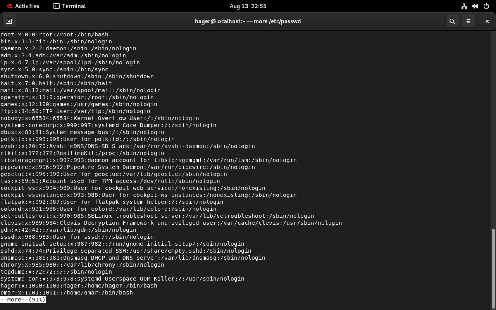

# **📌3-Explain the difference between the rm and rmdir commands.**📌

rm >> remove files and -r for non empty dir
rmdir >> remove empty dir 

# **📌4- Create the following directory structure from your home directory:  **📌

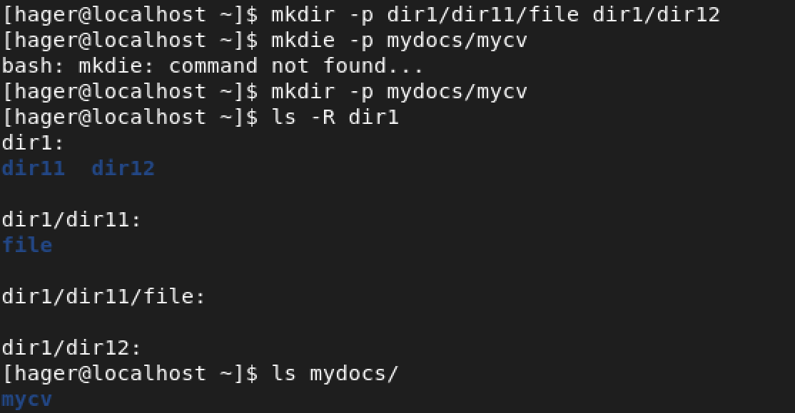

# **📌4- Try removing dir11 in one step using rmdir. What do you notice? How can you overcome this?  **📌

it's not empty should use rm -r 

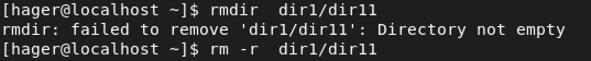

# **📌5- Remove dir12 using rmdir -p. What happened to the hierarchy? Describe the result.  **📌

not just remove the dir12 it remove the parent dir1 also because we use -p refere to parent dir 

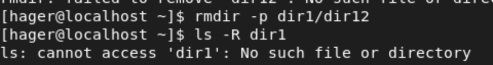

# **📌6- Copy /etc/passwd to your home directory and rename it to mypassword. **📌

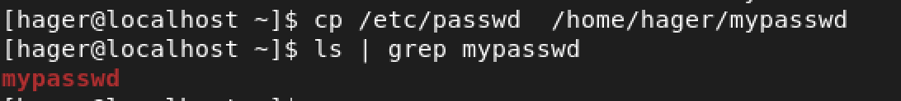

# **📌7- Rename mypassword to oldpasswd. **📌

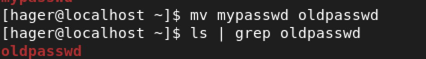

# **📌8- Explain the fields in the /etc/shadow file and what each field is used for. **📌

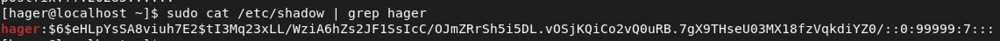

1- user name 
2- password hash (algorithem used - hased passwrd . salt . salt+password)
3- days since epoch when password was last changed
4- minimum days before change allowed
5- maximum days before required change (password expiry)
6- warn — days before expiry to warn user
7- inactive — days after expiry when account becomes inactive.
8- expire — absolute day (since epoch) when account disabled
9- reserved — unused

# **📌9- List all available Unix shells (from /etc/shells). **📌

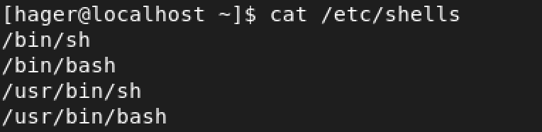

# **📌10- From /usr/bin, list 4 different ways to go back to your home directory. **📌

cd 
cd ~
cd /home/hager
cd $HOME

# **📌11- Display the first 4 lines of /etc/passwd. **📌

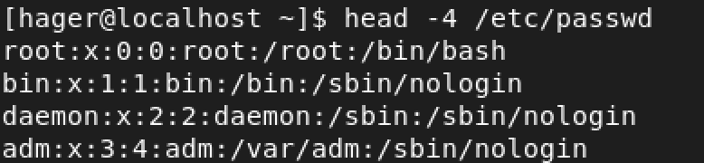

# **📌12- Display the last 7 lines of /etc/passwd. **📌

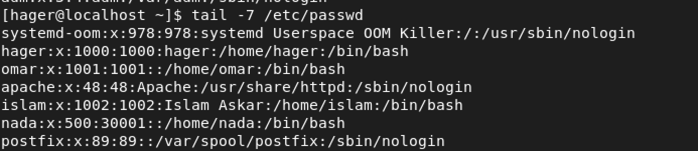

# **📌13- Display the users who are currently logged in. **📌

whoami

# **📌14- Display the number of user accounts in the system. **📌

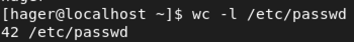

# **📌15- Create a user:  **📌
○ Username: islam
○ Comment (Full name): Islam Askar
○ Password: islam

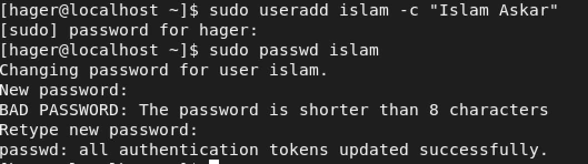

# **📌16- Create another user: **📌
○ Username: baduser
○ Comment: Bad User
○ Password: baduser 

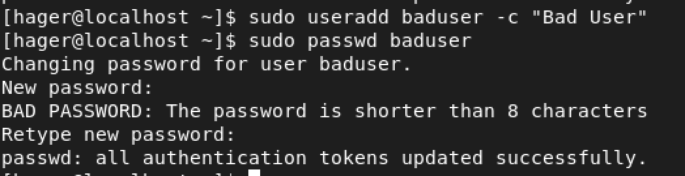

# **📌17- Create a supplementary group called pgroup with GID 30000.**📌

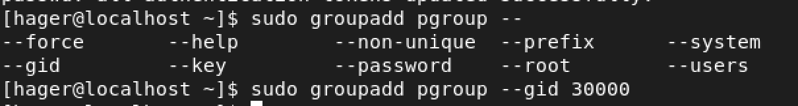

# **📌18- Create another supplementary group called badgroup.**📌

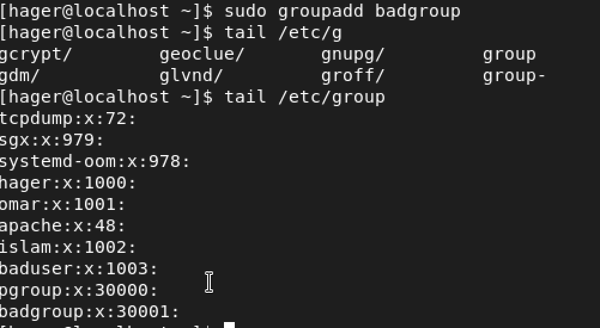

# **📌19-Add islam to the pgroup group as a secondary group.**📌

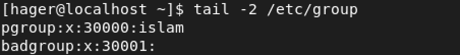

# **📌20-Change islam’s password to password.**📌

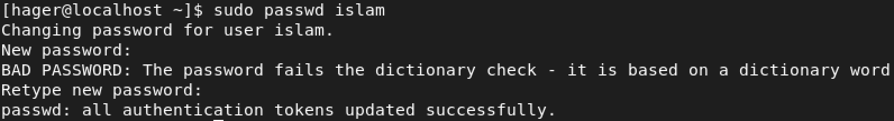

# **📌21-Set islam’s password to expire after 30 days.**📌

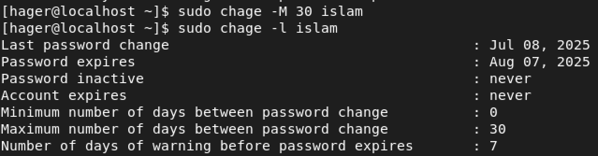

# **📌22-Lock the baduser account.**📌

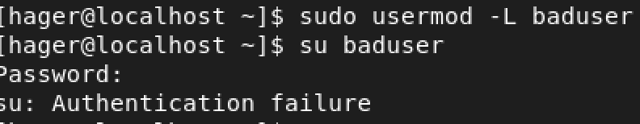

# **📌23-Delete the baduser account.**📌

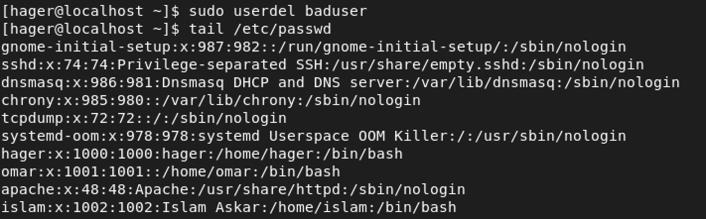

# **📌24-Delete the badgroup supplementary group.**📌

# **📌25-Create a folder myteam in your home directory and change its permission to read-only for the owner.**📌

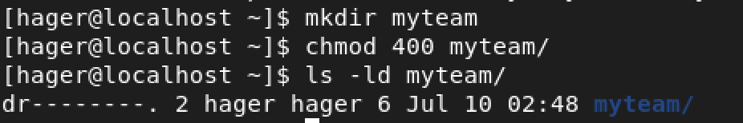

# **📌26-Log out and log in as another user and try to cd into myteam. What happens?**📌

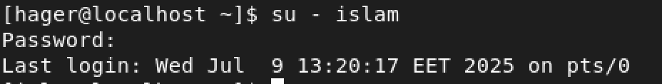

# **📌26-Log out and log in as another user and try to cd into myteam. What happens?**📌

# **📌27-What are the minimum permissions needed for the following:**📌

- Copy a directory (permission for source directory and permissions for target parent directory)
### for source >>> rx
### for target >>> wx

- Copy a file (permission for source file and and permission fortarget parentdirectory)
### for source >>> r
### for target >>> wx

- Delete a file
### wx
- Change to a directory
### x
- List a directory content (ls command)
### rx
- View a file content (more/cat command)
### r
- Modify a file content
### w

# **📌28-Create a file with permission 444 and:**📌

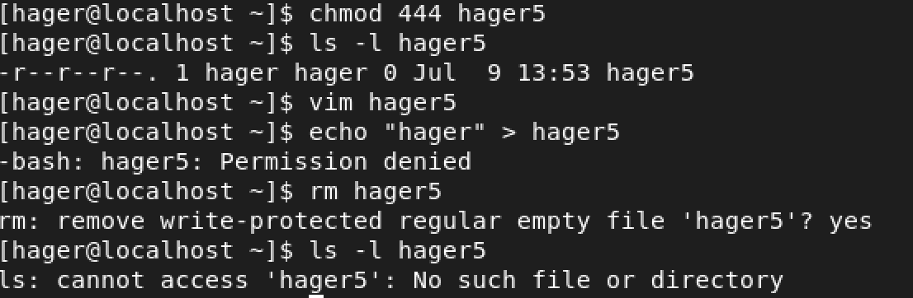
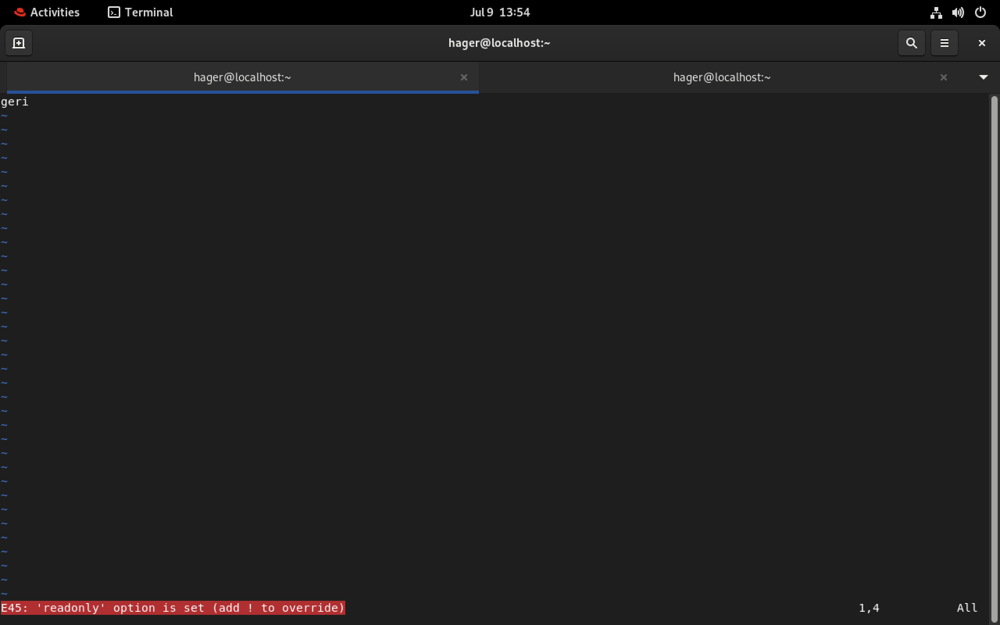

# **📌29-What is the difference between the x permission for:**📌

### for file>>> run if it script
### for dir>>> cd in this dir 

# **📌30-Configure a static IP address on your Linux system**📌

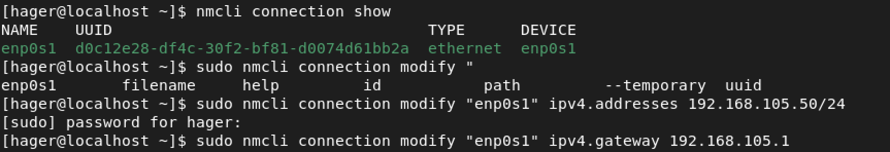
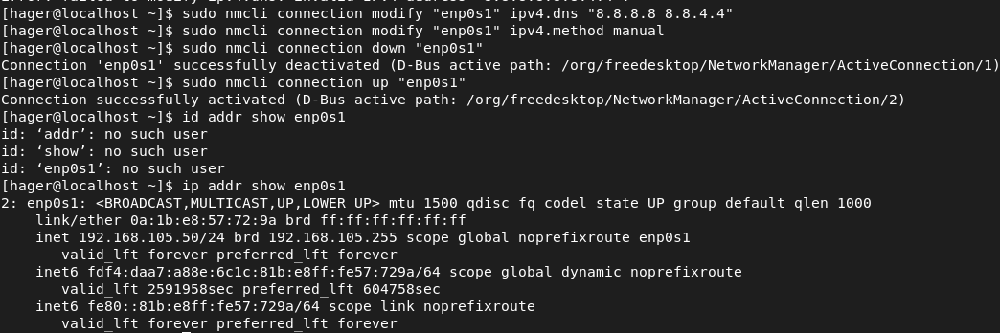

# **📌31- Use the following commands to test and analyze network connectivity to 8.8.8.8:**📌

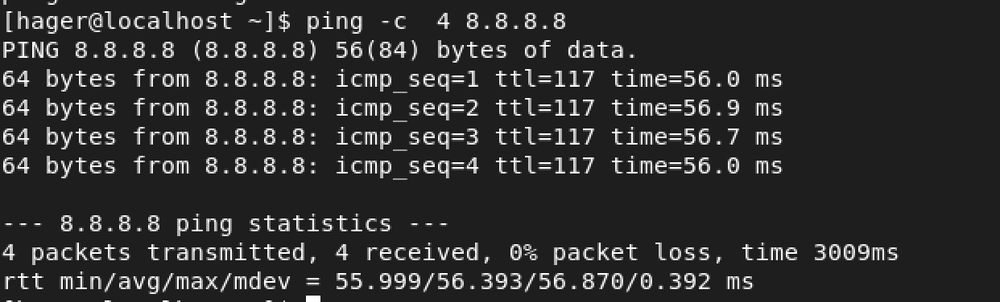
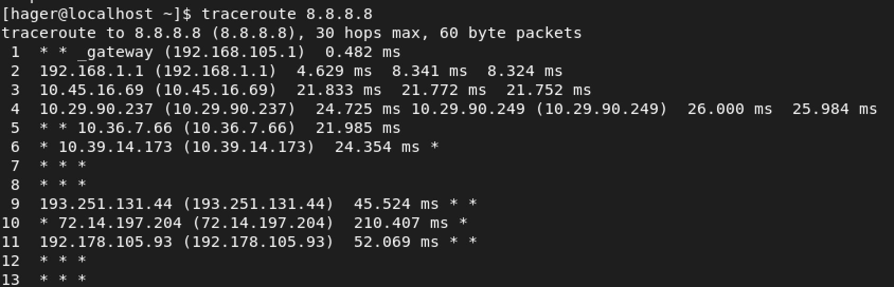
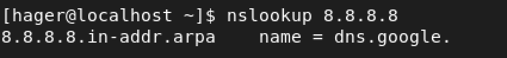

# **📌32-  Explain what a firewall is, how to enable it on Linux, and how to allow a specific port through it. **📌

it can block/allow ports, IPs, protocols, protecting the host or network.

sudo systemctl enable --now firewalld
sudo firewall-cmd --state
# allow port 8080/tcp permanently
sudo firewall-cmd --permanent --add-port=8080/tcp
sudo firewall-cmd --reload
sudo firewall-cmd --list-ports

# **📌32- Run the sleep 50 command in the background using &. Then, run it normally, send it to the background after starting, find its process ID without using ps, and force kill it. **📌

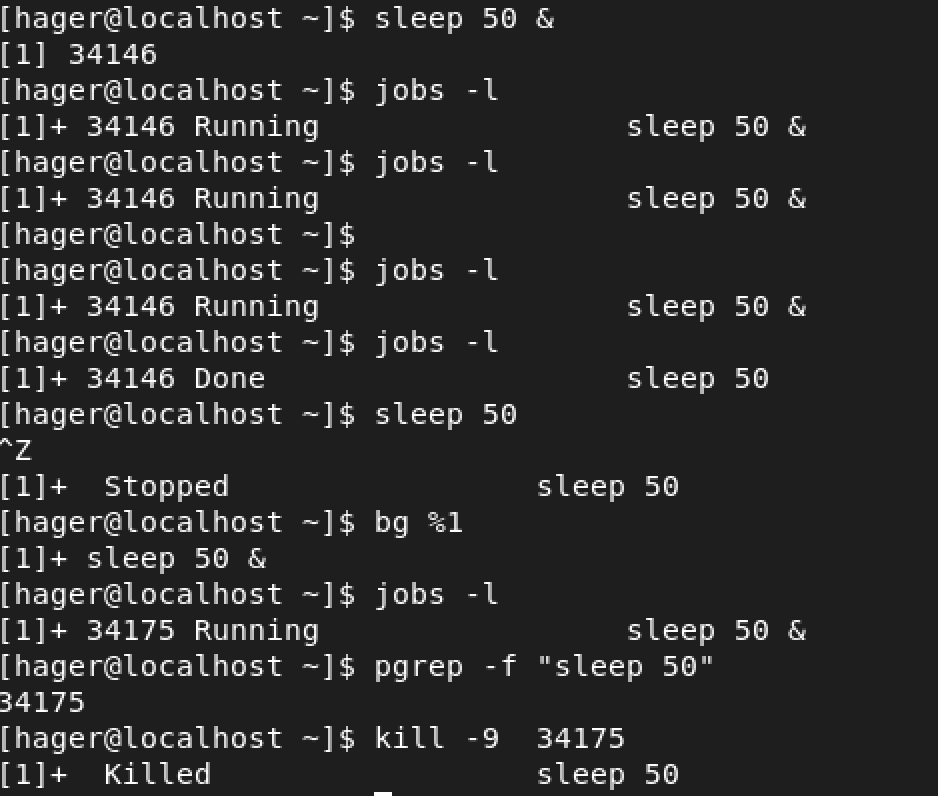
