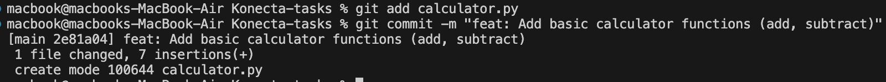
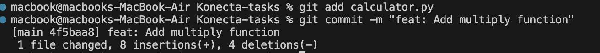
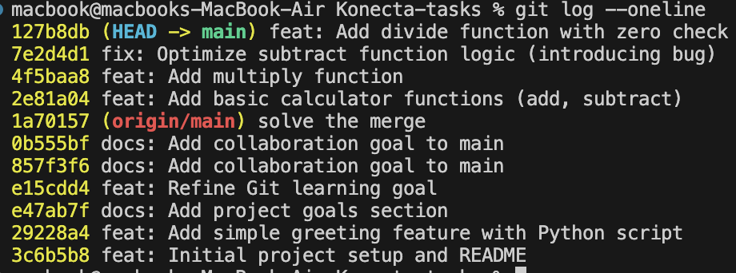
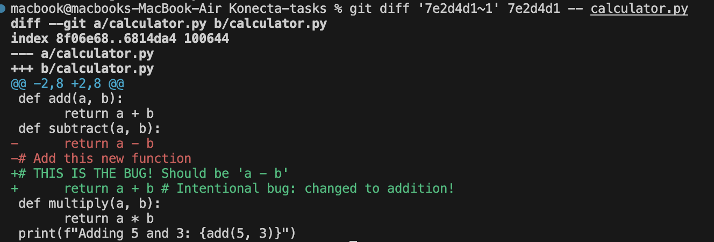
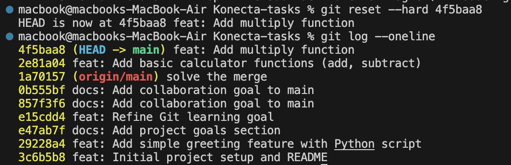
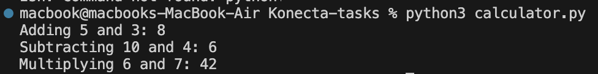
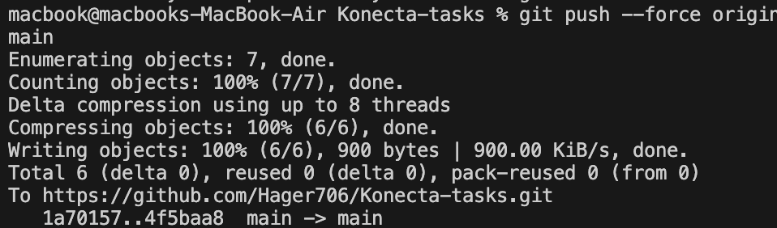

# **📌1- A list of all Git commands you used**📌
```bash
<pre><code>
git add calculator.py
git commit -m "feat: Add basic calculator functions (add, subtract)"
git add calculator.py
git commit -m "feat: Add multiply function"
git add calculator.py
git commit -m "fix: Optimize subtract function logic (introducing bug)"
git status
git log --oneline 
git add calculator.py
git commit -m "feat: Add divide function with zero check"
git diff '7e2d4d1~1' 7e2d4d1 -- calculator.py
git status 
git stash
git reset --hard 4f5baa8
git log --oneline 
python3 calculator.py
git stash pop
git push --force origin
</code></pre>

```

# **📌2-Screenshots of your terminal output**📌

















# **📌3-Your final calculator.py file**📌
```bash
#calculator.py
def add(a, b):
      return a + b
def subtract(a, b):
      return a - b
#Add this new function
def multiply(a, b):
      return a * b
print(f"Adding 5 and 3: {add(5, 3)}")
print(f"Subtracting 10 and 4: {subtract(10, 4)}")
print(f"Multiplying 6 and 7: {multiply(6, 7)}")
print(f"Dividing 20 by 5: {divide(20, 5)}")
#calculator.py (at the very end of the file)
#Some new experimental print statement
print("Experimental feature: Fibonacci sequence next")
```

# **📌4-Written Explanations**📌

## 1-Briefly explain how git log and git diff helped you identify the erroneous commit.

git log helped me see the history of commits, so I could identify which commit introduced the bug.
Then, git diff allowed me to compare the buggy commit with the previous one, so I could see exactly which line caused the problem.

## 2-Explain why git stash was necessary in this scenario.

git stash was necessary because I wanted to temporarily save my current code changes without committing them so git safely stored my changes, and I was able to bring them back later

## 3-Crucially, explain your choice between git reset --hard and git revert. Detail the pros and cons of the method you chose in this specific scenario, and when you would use the other method.

I chose git reset --hard because I wanted to completely remove the buggy commit from the history this method was faster and cleaner since I was working alone and didn’t need to preserve the commit record
Pros:
	•	Fully removes the commit and its changes
	•	Keeps history clean

Cons:
	•	Rewrites history
	•	Dangerous on shared branches 

I would use git revert instead if I was working in a team or on a shared branch, because it’s safer and keeps the history intact by adding a new commit that undoes the previous one

## 5-Briefly explain the difference between git stash pop and git stash apply.

git stash apply applies the stashed changes but keeps them in the stash list, so you can reuse them again if needed

git stash pop also applies the stashed changes, but removes them from the stash list after applying

the repo link : https://github.com/Hager706/Konecta-tasks