# 🧑‍🎓 Task: Docker Images & Networking 

## 🧪 Part 1: Working with Docker Images

1. **Pull the Alpine and Nginx images:**
## ❓ Additional Questions – Docker Images (No Dockerfile / Build)

```bash
docker pull alpine
docker pull nginx
```
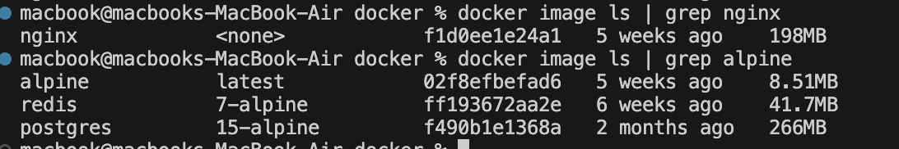

1. **What is the difference between an image and a container?**  
   Image = template (like a class), Container = running instance (like an object). Image is read-only, container has writable layer.

2. **What happens if you run `docker run nginx` twice without removing the first container? Why?**
   Creates 2 separate containers from same image. Each gets unique ID.

3. **Can two containers be created from the same image at the same time? What happens to their file systems?**
   Yes. Each gets its own writable layer, completely isolated.

4. **What’s the difference between `docker image ls` and `docker ps`? When would you use each?**
   `image ls` shows images , `ps` shows running containers.

5. **What’s the purpose of tagging an image (e.g., `myapp:1.0`)? What happens if you don’t specify a tag?**
   Version control. `nginx:1.21` vs `nginx:latest`. No tag = uses `latest`.

6. **How does Docker know which image to use when you run `docker run ubuntu`?**
   Checks locally first, then pulls from Docker Hub if not found.

7. **If you delete a container, does it delete the image too? Why or why not?**
   No. Images stay until you `docker rmi`. Multiple containers can use same image.

8. **What does this command do?**
   ```bash
     docker pull ubuntu && docker run -it ubuntu
   ```
   Downloads ubuntu then runs interactive shell inside it.

9. **You have a local image `nginx:latest`. What happens if you run `docker pull nginx` again? Will it download the image again? Why or why not?**
   Only downloads if remote is newer. Uses layer caching.

10. **What’s the difference between these two commands:**
    ```bash
    docker rmi nginx
    docker image prune
    ```
        `rmi` removes specific image, `prune` removes all unused images.


11. **True or False:** Docker images can be shared between different operating systems.  
    ➤ *Explain your answer.*

    Mostly yes, but architecture matters (x86 vs ARM).

12. **Can you save a Docker image as a file and share it without pushing it to Docker Hub? How?**
    `docker save -o file.tar image` then `docker load -i file.tar`

13. **What is the result of this command? Why might you use it?**
    ```bash
    docker save -o backup.tar nginx
    ```
    Exports nginx image to tar file for backup/transfer.

14. **How can you copy an image from one machine to another without using Docker Hub or a registry?**
    Save to tar, transfer file, load on other machine.

15. **How do you inspect the internal metadata of an image? What kind of information can you find?**
    `docker inspect image` shows env vars, ports, layers, etc.

## 🌐 Part 2: Networking and Bridge Mode

4. **Run two containers without specifying a network:**

docker run -d -it --name c1 alpine sh
docker run -d -it --name c2 alpine sh

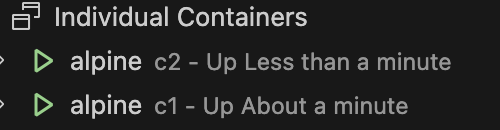

5. **Try to ping `container1` from `container2`:**

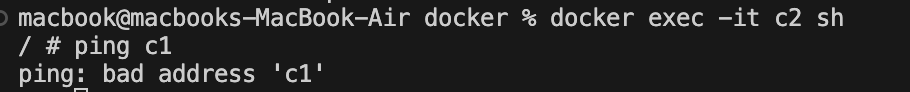

   - What happens? Why?
Fails : containers on default bridge can’t resolve names.

6. **Inspect the `docker0` bridge network and check container IPs:**
docker network inspect bridge 
7. **Now try pinging `container1` from `container2` using IP address.**
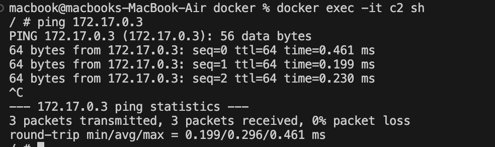
Works : IP-based communication is possible.

---

## 🌍 Part 3: Port Forwarding

8. **Run an Nginx container with port forwarding:**

docker run -d -p 8080:80 --name nginx1 nginx

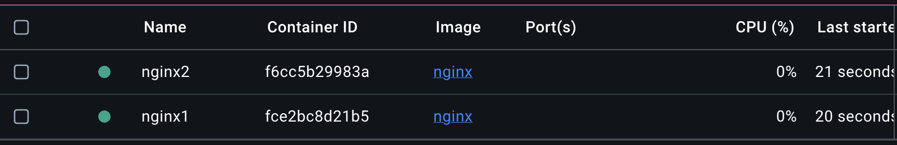

9. **Access the container from the browser or using `curl`:**
curl http://localhost:8080
 Nginx welcome page returned

10. **Try running a second Nginx container with the same port mapping. What happens? Why?**
Fails : host port already bound. Must use another port, e.g. -p 8081:80.
#####
#####

# 🧑‍🎓 Task: Docker Volums


## Part 1 – Basic Dockerfile
1. Create a directory named `docker_task`.
2. Inside it, create a file named `Dockerfile` that:
   - Uses **`alpine`** as the base image.
   - Installs `curl`
   - Runs `cat hello from container` when the container starts.
3. Build the image and tag it as `my-basic-image:v1`.

**Dockerfile:**
```dockerfile
FROM alpine
RUN apk add --no-cache curl
CMD echo "hello from container"
```

```bash
docker build -t my-basic-image:v1 .
docker run my-basic-image:v1
```
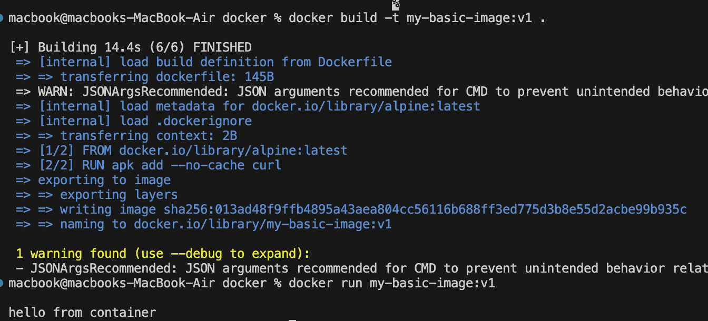

---

## Part 2 – Volumes
You must demonstrate **three types of Docker volumes**:

### 1. Bind Mount
- Create a local directory `data_bind` and put a file `bind_note.txt` inside it.
- Run the container so that `/app/data` inside the container is linked to `data_bind` on your local machine.
- Verify that changes in the container are reflected locally.


### 2. Named Volume
- Create a named volume called `my_named_volume`.
- Run the container using this named volume mounted at `/app/named`.
- Create a file inside `/app/named` from inside the container and check it persists after container deletion.

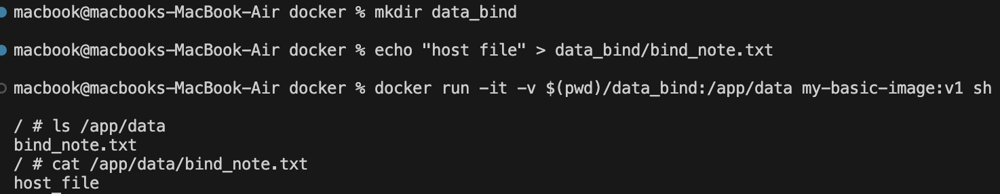

after deletion 
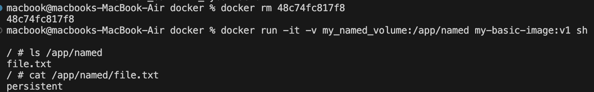

### 3. Anonymous Volume
- Run the container with an anonymous volume mounted at `/app/anon`.
- Verify the anonymous volume is created by listing all volumes after the container starts.

```bash
docker run -it -v /app/anon my-basic-image:v1 sh
docker volume ls
```
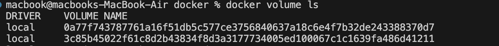

----
# 🧑‍🎓 Task: Dockerfile
# containerized the following App

## Starter app (provided)

### `package.json`
```json
{
  "name": "ts-api-demo",
  "version": "1.0.0",
  "type": "module",
  "main": "dist/index.js",
  "scripts": {
    "dev": "tsx watch src/index.ts",
    "build": "tsc -p tsconfig.json",
    "start": "node dist/index.js"
  },
  "dependencies": {
    "express": "^4.19.2"
  },
  "devDependencies": {
    "@types/express": "^4.17.21",
    "tsx": "^4.15.7",
    "typescript": "^5.5.4"
  }
}
```

### `tsconfig.json`
```json
{
  "compilerOptions": {
    "target": "ES2022",
    "module": "ES2022",
    "moduleResolution": "bundler",
    "outDir": "dist",
    "rootDir": "src",
    "esModuleInterop": true,
    "strict": true
  },
  "include": ["src"]
}
```

### `src/index.ts`
```ts
import express from "express";
const app = express();
const PORT = Number(process.env.PORT || 3000);
const APP_NAME = process.env.APP_NAME || "TS API";

app.get("/health", (_req, res) => {
  res.json({ ok: true, service: APP_NAME });
});

app.get("/whoami", (_req, res) => {
  res.json({ uid: process.getuid?.(), gid: process.getgid?.() });
});

app.listen(PORT, "0.0.0.0", () => {
  console.log(`[${APP_NAME}] listening on ${PORT}`);
});
```
## Part A — Single-stage image (intentionally sloppy)

Create **`Dockerfile.single`** that:

- uses `node:20`
- installs dependencies
- builds the app
- starts with `npm run start`
- **must work** at `http://localhost:3000/health`

```dockerfile
FROM node:20

WORKDIR /app

COPY package*.json ./
RUN npm install

COPY . .
RUN npm run build

EXPOSE 3000
CMD ["npm", "run", "start"]
```
**Build and run:**
```bash
docker build -f Dockerfile.single -t ts-api-single .
docker run -p 3000:3000 ts-api-single

curl http://localhost:3000/health
```

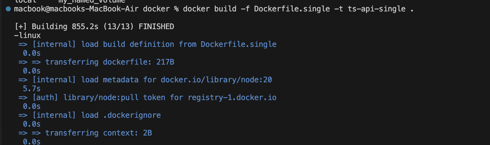
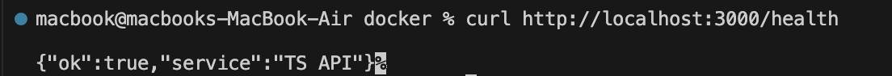
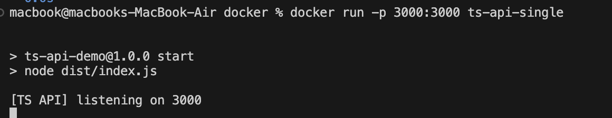

---
