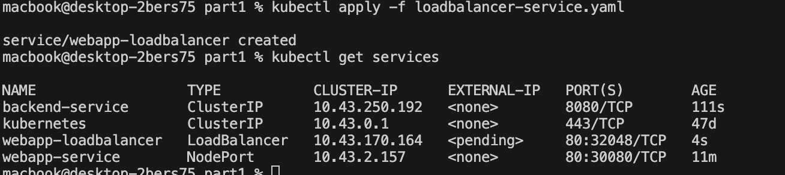
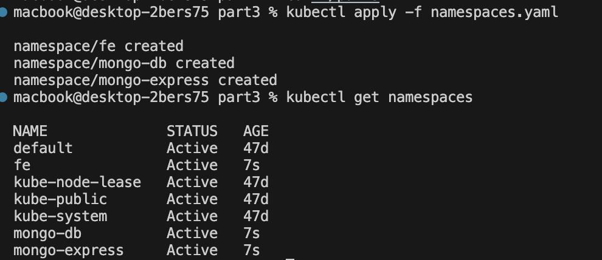

# Kubernetes Lab Exercise - Complete Guide

## Part 1: Basic Kubernetes Operations

### Q1: Create pod nginx with name my-nginx (direct command, no YAML)

**Explanation**: We'll create a simple nginx pod using the kubectl run command directly without creating a YAML file.

**Command used**:
```bash
kubectl run my-nginx --image=nginx
```

**Output**:
```
pod/my-nginx created
```

**Verification**:
```bash
kubectl get pods
```


---

### Q2: Create pod nginx with name my-nginx using nginx123 image (direct command, no YAML)

**Explanation**: We'll attempt to create a pod with a non-existent nginx image to demonstrate error handling.

**Command used**:
```bash
kubectl run my-nginx-123 --image=nginx123
```

**Output**:
```
pod/my-nginx-123 created
```


---

### Q3: Check the status and why it doesn't work

**Explanation**: We'll check the pod status to see why the nginx123 image failed to run.

**Commands used**:
```bash
kubectl get pods
kubectl describe pod my-nginx-123
```


**Output**:


**Explanation of issue**: The pod fails because nginx123 is not a valid Docker image. The error shows "ErrImagePull" or "ImagePullBackOff" indicating Kubernetes cannot pull the specified image from the registry.

---

### Q4: Get node name, IP, and Image of the POD

**Explanation**: We'll gather detailed information about the running pod including which node it's scheduled on and its IP address.

**Commands used**:
```bash
kubectl get pods -o wide
kubectl describe pod my-nginx
```

**Output**:


---

### Q5: Delete the pod

**Explanation**: We'll clean up the pods we created earlier.

**Commands used**:
```bash
kubectl delete pod my-nginx
kubectl delete pod my-nginx-123
```

**Output**:


---

### Q6: Create another pod with YAML file and use labels

**Explanation**: We'll create a pod using a YAML file and include labels for better organization.

**YAML file (nginx-pod.yaml)**:
```yaml
apiVersion: v1
kind: Pod
metadata:
  name: my-nginx-labeled
  labels:
    app: nginx
    environment: dev
spec:
  containers:
  - name: nginx-container
    image: nginx
    ports:
    - containerPort: 80
```

**Commands used**:
```bash
kubectl apply -f nginx-pod.yaml
kubectl get pods --show-labels
```

**Output**:


---

### Q7: Create ReplicaSet with 3 replicas using nginx image

**Explanation**: We'll create a ReplicaSet to manage multiple nginx pod replicas for high availability.

**YAML file (nginx-replicaset.yaml)**:
```yaml
apiVersion: apps/v1
kind: ReplicaSet
metadata:
  name: nginx-replicaset
spec:
  replicas: 3
  selector:
    matchLabels:
      app: nginx
  template:
    metadata:
      labels:
        app: nginx
    spec:
      containers:
      - name: nginx
        image: nginx
        ports:
        - containerPort: 80
```

**Commands used**:
```bash
kubectl apply -f nginx-replicaset.yaml
kubectl get replicasets
kubectl get pods
```

**Output**:


---

### Q8: Scale the replicas to 5 without editing YAML file

**Explanation**: We'll use the kubectl scale command to increase the number of replicas dynamically.

**Command used**:
```bash
kubectl scale replicaset nginx-replicaset --replicas=5
```

**Output**:


**Verification**:
```bash
kubectl get replicasets
kubectl get pods
```


---

### Q9: Delete one pod and check what happens

**Explanation**: We'll delete one pod to demonstrate how ReplicaSet maintains the desired state by creating a new pod.

**Commands used**:
```bash
kubectl get pods
kubectl delete pod <pod-name>
kubectl get pods
```

**What happens**: ReplicaSet immediately creates a new pod to maintain the desired replica count of 5. This demonstrates Kubernetes' self-healing capability.


---

### Q10: Scale down to 2 pods without scale command using terminal

**Explanation**: We'll edit the ReplicaSet directly to change the replica count.

**Command used**:
```bash
kubectl edit replicaset nginx-replicaset
```

**Action**: Change `replicas: 5` to `replicas: 2` in the editor, save and exit.


**Output**: 3 pods will be terminated, leaving only 2 running.

---

### Q11: Find the issue in ReplicaSet YAML

**Explanation**: There's a mismatch between the selector and template labels.

**Issue**: 
- Selector looks for `tier: frontend`
- Template creates pods with `tier: nginx`

**Fix**: Change template label from `tier: nginx` to `tier: frontend`

**Corrected YAML**:
```yaml
apiVersion: apps/v1
kind: ReplicaSet
metadata:
  name: replicaset-2
spec:
  replicas: 2
  selector:
    matchLabels:
      tier: frontend
  template:
    metadata:
      labels:
        tier: frontend  # Changed from 'nginx' to 'frontend'
    spec:
      containers:
      - name: nginx
        image: nginx
```

---

### Q12: Find the issue in Deployment YAML

**Explanation**: The kind should be "Deployment" (capital D), not "deployment".

**Issue**: `kind: deployment` should be `kind: Deployment`

**Corrected YAML**:
```yaml
apiVersion: apps/v1
kind: Deployment  # Changed from 'deployment' to 'Deployment'
metadata:
  name: deployment-1
spec:
  replicas: 2
  selector:
    matchLabels:
      name: busybox-pod
  template:
    metadata:
      labels:
        name: busybox-pod
    spec:
      containers:
      - name: busybox-container
        image: busybox
        command:
        - sh
        - "-c"
        - echo Hello Kubernetes! && sleep 3600
```

---

### Q13: Find the issue in Deployment YAML

**Explanation**: The apiVersion is incorrect for Deployment objects.

**Issue**: `apiVersion: v1` should be `apiVersion: apps/v1` for Deployment

**Corrected YAML**:
```yaml
apiVersion: apps/v1  # Changed from 'v1' to 'apps/v1'
kind: Deployment
metadata:
  name: deployment-1
spec:
  replicas: 2
  selector:
    matchLabels:
      name: busybox-pod
  template:
    metadata:
      labels:
        name: busybox-pod
    spec:
      containers:
      - name: busybox-container
        image: busybox
        command:
        - sh
        - "-c"
        - echo Hello Kubernetes! && sleep 3600
```

---

### Q14: Command to know what Image name is running in the deployment

**Explanation**: We'll use kubectl describe or get commands to find the image information.

**Commands used**:
```bash
kubectl get deployment deployment-1 -o yaml | grep image
```

---

### Q15: Create deployment with specified data

**Explanation**: We'll create a deployment for httpd with 3 replicas using the alpine variant.

**YAML file (httpd-deployment.yaml)**:
```yaml
apiVersion: apps/v1
kind: Deployment
metadata:
  name: httpd-frontend
spec:
  replicas: 3
  selector:
    matchLabels:
      app: httpd-frontend
  template:
    metadata:
      labels:
        app: httpd-frontend
    spec:
      containers:
      - name: httpd
        image: httpd:2.4-alpine
        ports:
        - containerPort: 80
```

**Commands used**:
```bash
kubectl apply -f httpd-deployment.yaml
kubectl get deployments
```


---

### Q16: Replace image to nginx777 with command directly

**Explanation**: We'll use kubectl set image command to update the deployment image.

**Command used**:
```bash
kubectl set image deployment/httpd-frontend httpd=nginx777
```

**Output**:
```
deployment.apps/httpd-frontend image updated
```

**Verification**:
```bash
kubectl rollout status deployment/httpd-frontend
```

---

### Q17: Rollback to previous version

**Explanation**: We'll rollback the deployment to the previous working version.

**Commands used**:
```bash
kubectl rollout history deployment/httpd-frontend
kubectl rollout undo deployment/httpd-frontend
```

**Output**:
```
deployment.apps/httpd-frontend rolled back
```

---

### Q18: Create Simple Web Application with Dockerfile

**Explanation**: We'll create a custom web application using Docker and push it to DockerHub.

**Dockerfile**:
```dockerfile
FROM nginx:alpine
COPY index.html /usr/share/nginx/html/
EXPOSE 80
CMD ["nginx", "-g", "daemon off;"]
```

**index.html**:
```html
<!DOCTYPE html>
<html>
<head>
    <title>My Kubernetes App</title>
</head>
<body>
    <h1>Welcome to My Kubernetes Application!</h1>
    <p>This is running on Kubernetes cluster.</p>
</body>
</html>
```

**Commands used**:
```bash
docker build -t hagert/my-webapp:v1 .

docker login
docker push hagert/my-webapp:v1
```


---

### Q19: Deploy the Docker image from DockerHub

**Explanation**: We'll create a deployment using our custom image from DockerHub.

**YAML file (webapp-deployment.yaml)**:
```yaml
apiVersion: apps/v1
kind: Deployment
metadata:
  name: webapp-deployment
spec:
  replicas: 3
  selector:
    matchLabels:
      app: webapp
  template:
    metadata:
      labels:
        app: webapp
    spec:
      containers:
      - name: webapp
        image: yourusername/my-webapp:v1
        ports:
        - containerPort: 80
```

**Commands used**:
```bash
kubectl apply -f webapp-deployment.yaml
kubectl get deployments
kubectl get pods
```


---

### Q20: Expose Frontend using Service

**Explanation**: We'll create a NodePort service to make the application accessible from browser.

**YAML file (webapp-service.yaml)**:
```yaml
apiVersion: v1
kind: Service
metadata:
  name: webapp-service
spec:
  type: NodePort
  selector:
    app: webapp
  ports:
  - port: 80
    targetPort: 80
    nodePort: 30080
```

**Commands used**:
```bash
kubectl apply -f webapp-service.yaml
kubectl get services
minikube service webapp-service --url
```


---

### Q21: Create Backend Deployment

**Explanation**: We'll create a Python backend deployment that serves HTTP on port 8080.

**YAML file (backend-deployment.yaml)**:
```yaml
apiVersion: apps/v1
kind: Deployment
metadata:
  name: backend-deployment
spec:
  replicas: 1
  selector:
    matchLabels:
      app: backend
  template:
    metadata:
      labels:
        app: backend
    spec:
      containers:
      - name: python-backend
        image: python:3.8-slim
        command: ["python", "-m", "http.server", "8080"]
        ports:
        - containerPort: 8080
```

**Commands used**:
```bash
kubectl apply -f backend-deployment.yaml
kubectl get deployments
```


---

### Q22: Expose Backend Internally using Service

**Explanation**: We'll create a ClusterIP service for internal access and use port-forwarding for browser access.

**YAML file (backend-service.yaml)**:
```yaml
apiVersion: v1
kind: Service
metadata:
  name: backend-service
spec:
  type: ClusterIP
  selector:
    app: backend
  ports:
  - port: 8080
    targetPort: 8080
```

**Commands used**:
```bash
kubectl apply -f backend-service.yaml
kubectl port-forward service/backend-service 8080:8080
```

**Access**: Open browser to `http://localhost:8080`


---

### Q23: Create LoadBalancer Service

**Explanation**: We'll create a LoadBalancer service and explain what happens in Minikube.

**YAML file (loadbalancer-service.yaml)**:
```yaml
apiVersion: v1
kind: Service
metadata:
  name: webapp-loadbalancer
spec:
  type: LoadBalancer
  selector:
    app: webapp
  ports:
  - port: 80
    targetPort: 80
```

**Commands used**:
```bash
kubectl apply -f loadbalancer-service.yaml
kubectl get services
```

**What happens in K3S**: K3s includes a built-in load balancer (Klipper Load Balancer) that automatically assigns external IPs to LoadBalancer services. Unlike Minikube, you don't need additional tools - the service will get an external IP automatically.



---

### Q24: Explain DaemonSet and Provide YAML

**Explanation**: A DaemonSet ensures that all (or some) nodes run a copy of a pod. It's typically used for:
- Cluster storage daemons (like glusterd, ceph)
- Log collection daemons (like fluentd, logstash)
- Node monitoring daemons (like Prometheus node exporter)

**YAML file (nginx-daemonset.yaml)**:
```yaml
apiVersion: apps/v1
kind: DaemonSet
metadata:
  name: nginx-daemonset
  labels:
    app: nginx-daemon
spec:
  selector:
    matchLabels:
      app: nginx-daemon
  template:
    metadata:
      labels:
        app: nginx-daemon
    spec:
      containers:
      - name: nginx
        image: nginx
        ports:
        - containerPort: 80
        resources:
          limits:
            memory: 200Mi
          requests:
            cpu: 100m
            memory: 200Mi
```

**Commands used**:
```bash
kubectl apply -f nginx-daemonset.yaml
kubectl get daemonsets
kubectl get pods -o wide
```


---

### Q25: Master Node Components

**Explanation**: The Kubernetes master node contains the control plane components:

1. **kube-apiserver**: 
   - Purpose: Exposes the Kubernetes API and serves as the front-end for the control plane
   - Handles all REST operations and validates/configures API objects

2. **etcd**: 
   - Purpose: Distributed key-value store that stores all cluster data
   - Maintains cluster state and configuration

3. **kube-scheduler**: 
   - Purpose: Selects which node an unscheduled pod should run on
   - Considers resource requirements, policies, and constraints

4. **kube-controller-manager**: 
   - Purpose: Runs controller processes that regulate cluster state
   - Includes Node Controller, Replication Controller, Endpoints Controller, etc.

5. **cloud-controller-manager** (if using cloud provider):
   - Purpose: Integrates with cloud-specific control logic
   - Manages cloud-specific resources like load balancers

---

### Q26: Worker Node Components

**Explanation**: Worker nodes run the actual application workloads:

1. **kubelet**: 
   - Purpose: Primary node agent that communicates with the master
   - Ensures containers are running in pods as expected

2. **kube-proxy**: 
   - Purpose: Network proxy that maintains network rules
   - Enables communication between pods and external traffic

3. **Container Runtime**: 
   - Purpose: Software responsible for running containers
   - Examples: Docker, containerd, CRI-O

4. **Pod**: 
   - Purpose: Smallest deployable unit containing one or more containers
   - Shares network and storage resources

---

## Part 2: Advanced Kubernetes Concepts

### Namespace
Namespaces provide a way to divide cluster resources between multiple users or teams. They're virtual clusters within a physical cluster.

### ConfigMap
ConfigMaps allow you to decouple configuration artifacts from image content to keep containerized applications portable.

### Secret
Secrets are used to store and manage sensitive information such as passwords, OAuth tokens, and SSH keys.

### Network Policy
Network Policies are specifications of how groups of pods are allowed to communicate with each other and other network endpoints.

### Taint and Toleration
Taints allow a node to repel a set of pods. Tolerations are applied to pods and allow them to schedule onto nodes with matching taints.

### Volume
Volumes provide persistent storage that can be shared between containers in a pod and persist beyond the pod's lifecycle.

---

## Part 3: Multi-Namespace Application Deployment

### Q1: Start K3S with 2 nodes

**Commands used**:
```bash
kubectl get nodes
```


---

### Q2: Create 3 namespaces

**YAML file (namespaces.yaml)**:
```yaml
apiVersion: v1
kind: Namespace
metadata:
  name: fe
---
apiVersion: v1
kind: Namespace
metadata:
  name: mongo-db
---
apiVersion: v1
kind: Namespace
metadata:
  name: mongo-express
```

**Commands used**:
```bash
kubectl apply -f namespaces.yaml
kubectl get namespaces
```


---

### Q3A: Frontend Application with emptyDir Volume

**YAML file (frontend-deployment.yaml)**:
```yaml
apiVersion: apps/v1
kind: Deployment
metadata:
  name: frontend-deployment
  namespace: fe
spec:
  replicas: 2
  selector:
    matchLabels:
      app: frontend
  template:
    metadata:
      labels:
        app: frontend
    spec:
      containers:
      - name: nginx
        image: nginx
        ports:
        - containerPort: 80
        volumeMounts:
        - name: web-content
          mountPath: /usr/share/nginx/html
      volumes:
      - name: web-content
        emptyDir: {}
---
apiVersion: v1
kind: Service
metadata:
  name: frontend-service
  namespace: fe
spec:
  type: NodePort
  selector:
    app: frontend
  ports:
  - port: 80
    targetPort: 80
    nodePort: 30080
```

---

### Q3B: MongoDB Deployment with Secrets and PV

**YAML file (mongodb-secret.yaml)**:
```yaml
apiVersion: v1
kind: Secret
metadata:
  name: mongodb-secret
  namespace: mongo-db
type: Opaque
data:
  username: YWRtaW4=  # base64 encoded 'admin'
  password: YWRtaW4xMjM=  # base64 encoded 'admin123'
```

**YAML file (mongodb-pv.yaml)**:
```yaml
apiVersion: v1
kind: PersistentVolume
metadata:
  name: mongodb-pv
spec:
  capacity:
    storage: 1Gi
  accessModes:
    - ReadWriteOnce
  hostPath:
    path: /data/mongodb
---
apiVersion: v1
kind: PersistentVolumeClaim
metadata:
  name: mongodb-pvc
  namespace: mongo-db
spec:
  accessModes:
    - ReadWriteOnce
  resources:
    requests:
      storage: 1Gi
```

**YAML file (mongodb-deployment.yaml)**:
```yaml
apiVersion: apps/v1
kind: Deployment
metadata:
  name: mongodb-deployment
  namespace: mongo-db
spec:
  replicas: 1
  selector:
    matchLabels:
      app: mongodb
  template:
    metadata:
      labels:
        app: mongodb
    spec:
      containers:
      - name: mongodb
        image: mongo:latest
        ports:
        - containerPort: 27017
        env:
        - name: MONGO_INITDB_ROOT_USERNAME
          valueFrom:
            secretKeyRef:
              name: mongodb-secret
              key: username
        - name: MONGO_INITDB_ROOT_PASSWORD
          valueFrom:
            secretKeyRef:
              name: mongodb-secret
              key: password
        volumeMounts:
        - name: mongodb-storage
          mountPath: /data/db
      volumes:
      - name: mongodb-storage
        persistentVolumeClaim:
          claimName: mongodb-pvc
---
apiVersion: v1
kind: Service
metadata:
  name: mongodb-service
  namespace: mongo-db
spec:
  type: ClusterIP
  selector:
    app: mongodb
  ports:
  - port: 27017
    targetPort: 27017
```

---

### Q3C: Mongo Express Deployment with ConfigMap

**YAML file (mongo-express-config.yaml)**:
```yaml
apiVersion: v1
kind: ConfigMap
metadata:
  name: mongo-express-config
  namespace: mongo-express
data:
  ME_CONFIG_MONGODB_SERVER: mongodb-service.mongo-db.svc.cluster.local
  ME_CONFIG_MONGODB_PORT: "27017"
  ME_CONFIG_MONGODB_ADMINUSERNAME: admin
  ME_CONFIG_MONGODB_ADMINPASSWORD: admin123
```

**YAML file (mongo-express-deployment.yaml)**:
```yaml
apiVersion: apps/v1
kind: Deployment
metadata:
  name: mongo-express-deployment
  namespace: mongo-express
spec:
  replicas: 1
  selector:
    matchLabels:
      app: mongo-express
  template:
    metadata:
      labels:
        app: mongo-express
    spec:
      containers:
      - name: mongo-express
        image: mongo-express:latest
        ports:
        - containerPort: 8081
        envFrom:
        - configMapRef:
            name: mongo-express-config
---
apiVersion: v1
kind: Service
metadata:
  name: mongo-express-service
  namespace: mongo-express
spec:
  type: NodePort
  selector:
    app: mongo-express
  ports:
  - port: 8081
    targetPort: 8081
    nodePort: 30081
```

---

### Q3D: Network Policy for mongo-db namespace

**YAML file (mongodb-network-policy.yaml)**:
```yaml
apiVersion: networking.k8s.io/v1
kind: NetworkPolicy
metadata:
  name: mongodb-network-policy
  namespace: mongo-db
spec:
  podSelector:
    matchLabels:
      app: mongodb
  policyTypes:
  - Ingress
  ingress:
  - from:
    - namespaceSelector:
        matchLabels:
          name: mongo-express
    ports:
    - protocol: TCP
      port: 27017
```

**Note**: You'll need to label the mongo-express namespace:
```bash
kubectl label namespace mongo-express name=mongo-express
```

---

### Q4: Taints and Tolerations

### Q4A: Taint one node

**Commands used**:
```bash
# Get node names
kubectl get nodes

# Taint a node
kubectl taint nodes minikube-m02 key=db:NoSchedule
```

### Q4B: Add toleration to MongoDB deployment

**Update mongodb-deployment.yaml** to include toleration:
```yaml
spec:
  template:
    spec:
      tolerations:
      - key: "key"
        operator: "Equal"
        value: "db"
        effect: "NoSchedule"
      containers:
      # ... rest of container spec
```

**Commands used**:
```bash
kubectl apply -f mongodb-deployment.yaml
kubectl get pods -n mongo-db -o wide
```

---

## Summary Commands for Verification

```bash
# Check all resources
kubectl get all --all-namespaces

# Check persistent volumes
kubectl get pv,pvc --all-namespaces

# Check network policies
kubectl get networkpolicies --all-namespaces

# Check node taints
kubectl describe nodes
```

