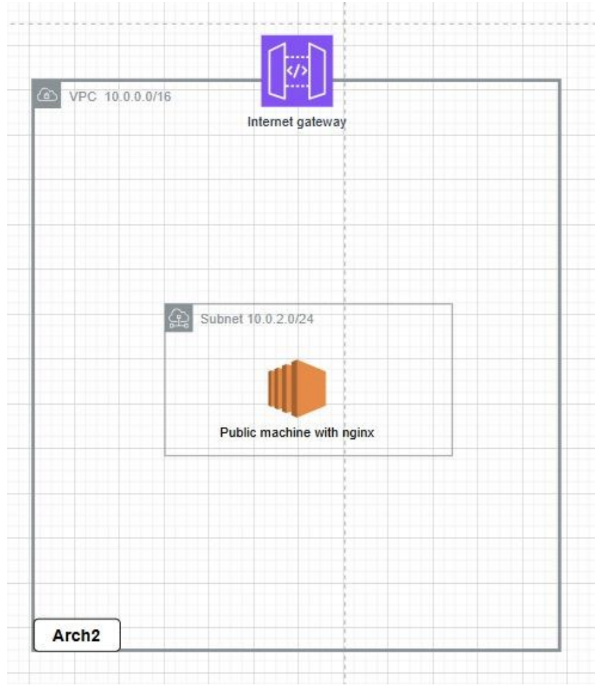
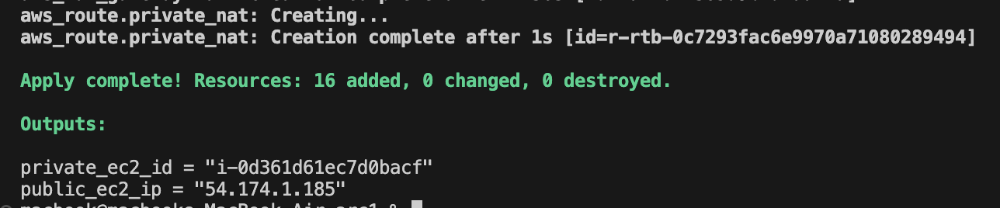
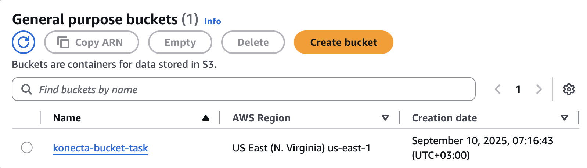
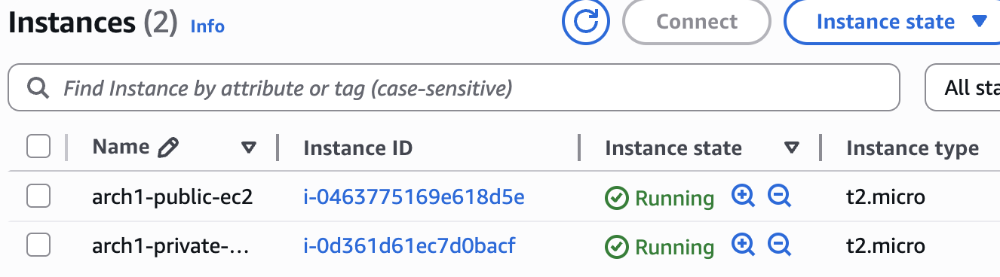
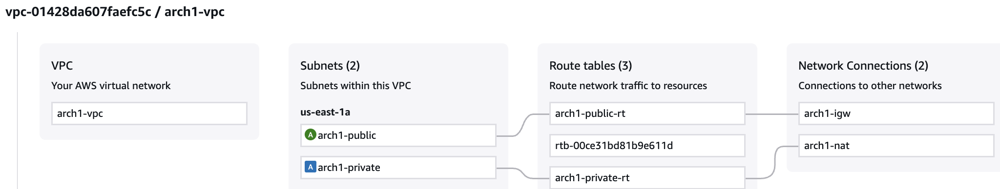
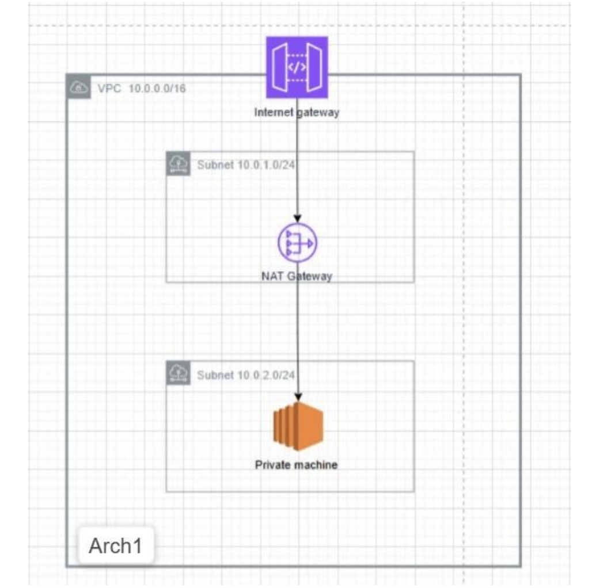
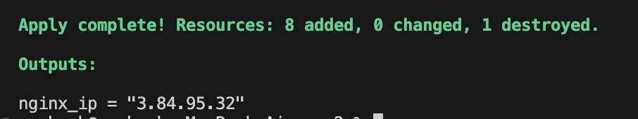
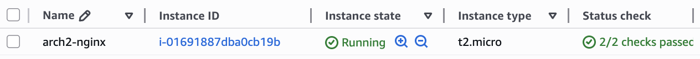
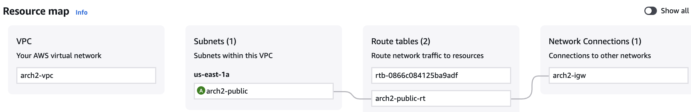

# Terraform Task

## 🌐 Overview

This project contains two separate infrastructures built on **AWS using Terraform**:

* **Architecture 1**: A manually defined VPC with networking and EC2 instances.
* **Architecture 2**: A modular implementation using Terraform modules for reusability.
* **State Management**: Both architectures use **S3 + DynamoDB** as a remote backend to store and lock the Terraform state file.

---

## 1️⃣ Architecture 1 – VPC with Public & Private EC2 Instances

###  Objective



The goal of this architecture is to build a **networking environment** with both **public and private subnets** and deploy EC2 instances inside them:

* **Public EC2** → Accessible via SSH and HTTP through the Internet Gateway.
* **Private EC2** → Has outbound access through a NAT Gateway, but no direct internet access.

###  Resources Created

1. **VPC** – Custom Virtual Private Cloud.
2. **Subnets** – One public subnet and one private subnet.
3. **Internet Gateway (IGW)** – Provides internet access for the public subnet.
4. **NAT Gateway** – Allows private instances to connect to the internet securely.
5. **Route Tables** – Configured for public and private routes.
6. **Security Groups** –

   * Public SG: Allows SSH (22) and HTTP (80).
   * Private SG: Allows only internal traffic.
7. **EC2 Instances** –

   * One in the public subnet.
   * One in the private subnet.

### Terraform Files

* **backend.tf** → Defines remote backend (S3 + DynamoDB).
* **variables.tf** → Contains all input variables (VPC CIDR, Subnets, AMI ID, etc.).
* **terraform.tfvars** → Stores actual values for the variables.
* **main.tf** → Contains the main configuration for networking and EC2 instances.
* **outputs.tf** → Exposes important values such as Public IP of EC2.

### Workflow

1. Define variables in `variables.tf` and assign values in `terraform.tfvars`.
2. Configure remote backend in `backend.tf`.
3. Write infrastructure resources in `main.tf`.
4. Run:

   ```bash
   terraform init
   terraform plan
   terraform apply -auto-approve
   ```
5. Verify created resources via AWS CLI.



6. Verify created resources via AWS  Console.







---

## 2️⃣ Architecture 2 – Modular Infrastructure

###  Objective



This architecture re-implements Arch1 but using **Terraform Modules** for better reusability and cleaner code.

* **Network Module** → Creates VPC, Subnets, IGW, NAT, and Route Tables.
* **EC2 Module** → Launches an EC2 instance with Nginx installed automatically (using `user_data`).

###  Resources Created

1. **VPC & Networking** (through `network` module).
2. **Public Subnet** with internet access.
3. **EC2 Instance** running Nginx with a pre-configured Security Group.

###  Terraform Files

* **modules/**

  * **network/** → Contains VPC and subnet configuration.
  * **ec2/** → Contains EC2 instance configuration + Security Group + User Data.
* **main.tf** → Calls the modules and passes variable values.
* **variables.tf** → Defines inputs for the modules.
* **terraform.tfvars** → Provides values (CIDR ranges, AMI IDs, instance type, etc.).
* **outputs.tf** → Outputs public IP of the EC2 instance.

###  Workflow

1. Define reusable modules in the `modules/` directory.
2. Call modules inside `main.tf` with proper arguments.
3. Run:

   ```bash
   terraform init
   terraform plan
   terraform apply -auto-approve
   ```
4. Verify created resources via AWS CLI.



5. Verify created resources via AWS Console.





---

repo link : https://github.com/Hager706/Konecta-tasks/tree/main/terraform